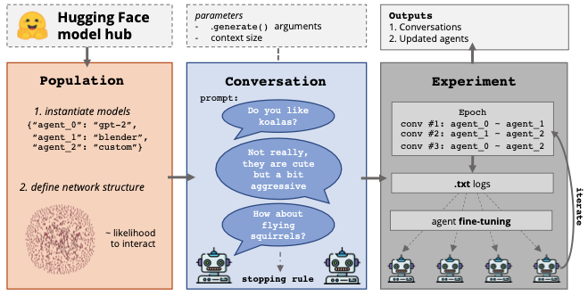

# Chatting Chatbots

A library for running experiments of multiple genarative language models having conversations with each other.

[](https://github.com/centre-for-humanities-computing/chatbot-conversations)
[](https://black.readthedocs.io/en/stable/the_black_code_style/current_style.html)
[](https://github.com/pytorch/pytorch)

## Installation

Install chatting chatbots from PiPy:

```bash
pip install chatting_chatbots
```

or directly from GitHub:

```bash
pip install git+https://github.com/centre-for-humanities-computing/chatbot-conversations
```

## Overview of Implementation



## Usage

The package currently works only with PyTorch and GPT-based models. Models tested: gpt2, gpt-j, gpt-neo, distilgpt2.

[](https://colab.research.google.com/github/centre-for-humanities-computing/chatbot-conversations/blob/main/tutorials/examples.ipynb)

An example of usage (seen in tutorials/examples.ipynb):

```python
import chatting_chatbots as cc

cc.Experiment(
    population = {"John" : "gpt2", "Margaret" : "gpt2"}, 
    cycles = 2,
    initial_context="Hi. Why are you late?",
    conversation_length=10,
    verbose = True,
    use_gpu=-1,
    use_files=True
    ).run()
``` 

Output from this example:
```
A conversation between John and Margaret: 

John: Hi. Why are you late?

Margaret: Oh, it's because I had an appointment at work today and now I want to do some shopping in the morning.

John: Oh, yes?

Margaret: Oh, yes.

John: No no, I really don't like shopping in the morning.

Margaret: I like shopping in the evenings.
```

## Parameters for `Experiment`
| **parameter**         | **type**          | **default**                       | **description**                                                                                                                                                                                                                                         |
| --------------------- | ----------------- | --------------------------------- | ------------------------------------------------------------------------------------------------------------------------------------------------------------------------------------------------------------------------------------------------------- |
| population            | dict              | required parameter                | A dictionary, where each element is an agent, defined as `"Agent_Name" : "Agent_Model"`. The model can either be the name of a model available on HuggingFace, or a list `[tokenizer, model]` of a tokenizer and a model you have already created.      |
| cycles                | int               | 1                                 | The number of cycles of conversation, where one cycle is each agent in the population talking to each other agent twice (starting the conversation once, and being second once).                                                                        |
| initial_context       | str               | "Hello."                          | The initial context the first agent in a conversation uses i.e. each conversation starts with this sentence.                                                                                                                                            |
| conversation_length   | int               | 10                                | The length of the conversation in turns (excluding the initial context).                                                                                                                                                                                |
| random_length         | int               | 0                                 | A randomisation variable for the length; the length is taken from a uniform distribution of `[conversation_length - random_length, conversation_length + random_length]`.                                                                               |
| training_args         | TrainingArguments | None                              | A TrainingArguments parameter passed to the HuggingFace `Trainer()` class. If `None`, some default parameters are used.                                                                                                                                 |
| verbose               | bool              | False                             | If set to `True`, class outputs some extra text about what is happening.                                                                                                                                                                                |
| use_files             | bool              | True                              | If set to `True`, during training, conversations are saved to files in the `output_path` directory, and all of the files in the `output_path` will be used for training. Otherwise, only the conversations generated during a single `.run()` are used. |
| use_gpu               | int               | -1                                | If not set, uses cpu, otherwise, uses the gpu specified.                                                                                                                                                                                                |
| generation_parameters | list              | None                              | A list of parameters used for the `model.generate()` function (not tested). If not used, some default parameters are used instead.                                                                                                                      |
| context_size          | int               | 600                               | How many tokens should be used on each generation. If set to 0, uses the entire conversation as context. Note that this is prone to crashing as some models cannot handle large contexts.                                                               |
| full_conversation     | bool              | True                              | If set to `True`, uses the entire conversation for training. If set to `False`, uses only the _other agent's_ text for training.                                                                                                                        |
| batch_size            | int               | 128                               | The batch size used for training. If the experiment crashes because of no examples for training, you should either decrease this value or increase the conversation length.                                                                             |
| train_after_run       | bool              | True                              | If set to `True`, every agent is trained after a `.run()`.                                                                                                                                                                                              |
| output_path           | str               | "outputs"                         | The path where the conversation files should be saved.                                                                                                                                                                                                  |
| cache_path            | str               | ".cache/huggingface/transformers" | The path where the models (if they are downloaded from HuggingFace) should be stored.                                                                                                                                                                   |

## Functions available

| function                  | arguments                        | return           | description                                                                                                                                                       |
| ------------------------- | -------------------------------- | ---------------- | ----------------------------------------------------------------------------------------------------------------------------------------------------------------- |
| conversation_generation() | str speaker_one, str speaker_two | str conversation | Generates a conversation between `speaker_one` and `speaker_two`. Returns the conversation. Note that the speakers must be in the population of the `Experiment`. |
| run()                     | -                                | -                | Runs the experiment by having each agent speak with each other agent for the set number of cycles, optionally training them afterwards.                           |
| train_participant()       | str participant                  | -                | Trains the participant specified. Note that the participant must be part of the `population` of the `Experiment`.                                                 |
| return_model              | str participant                  | model            | Returns the current model of the specified participant.                                                                                                           |


### Credits

This package was created using the [`Name`](https://github.com/KennethEnevoldsen/name) project template.